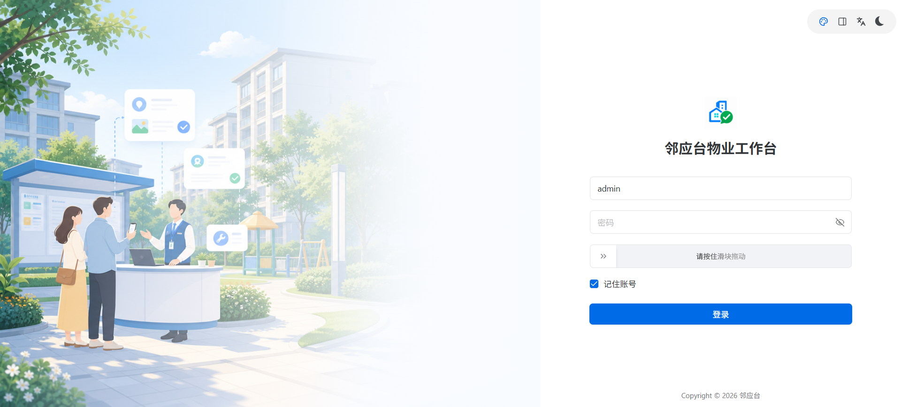
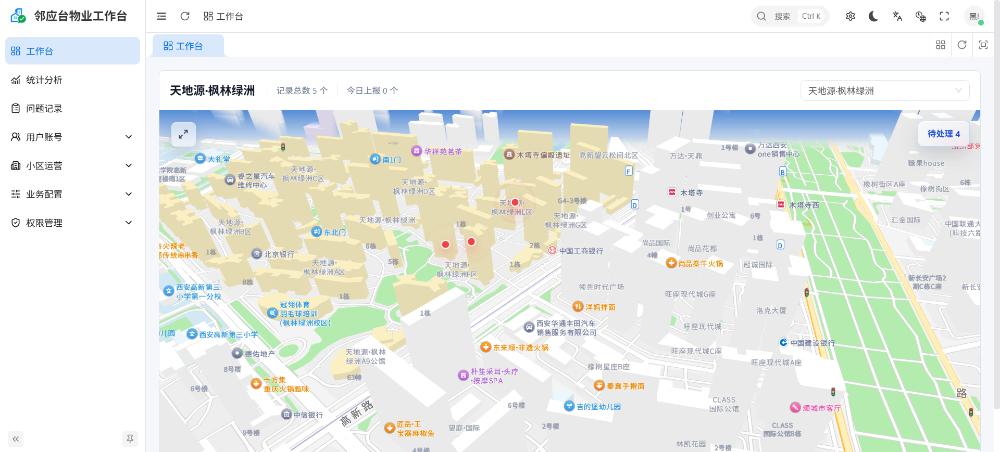
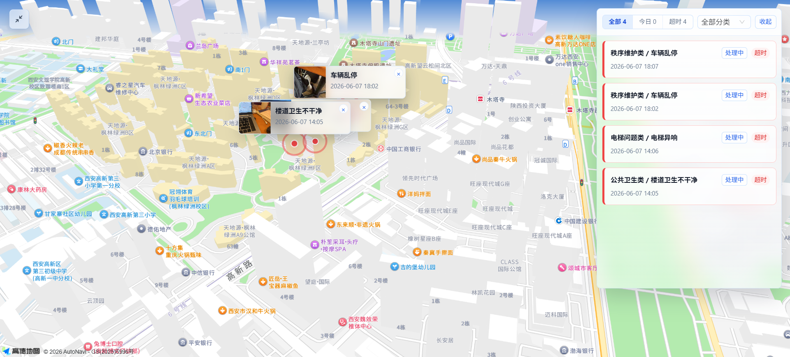
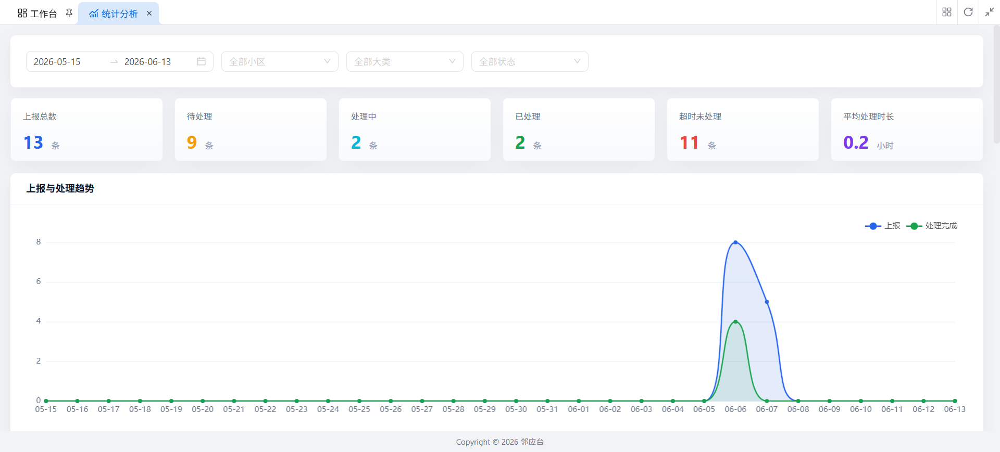
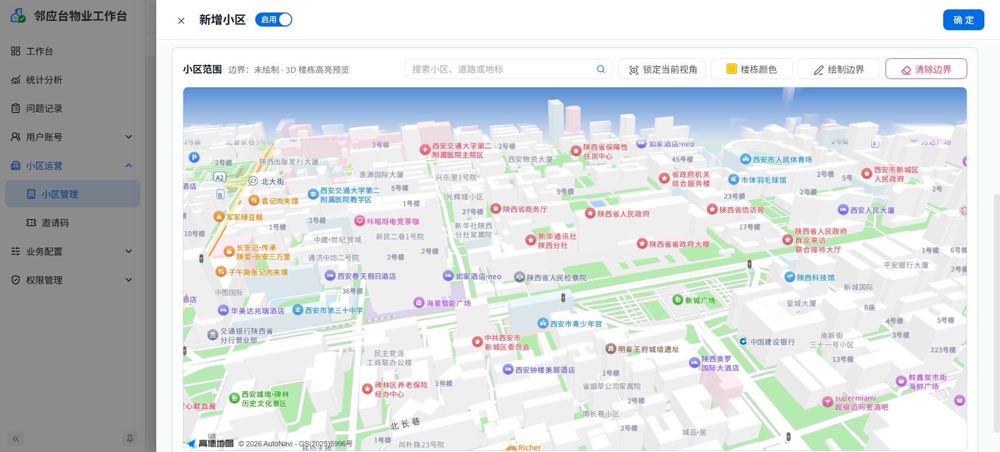
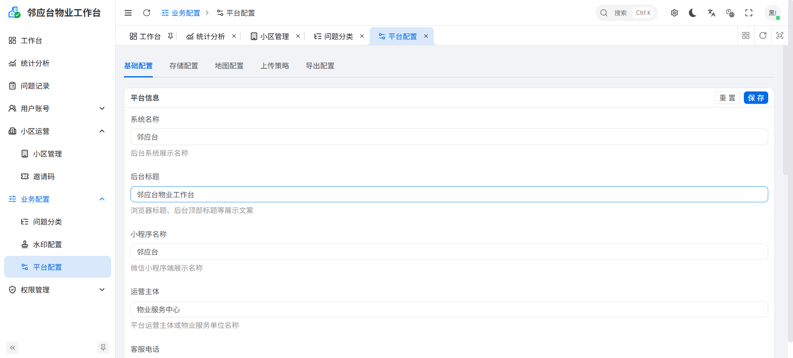
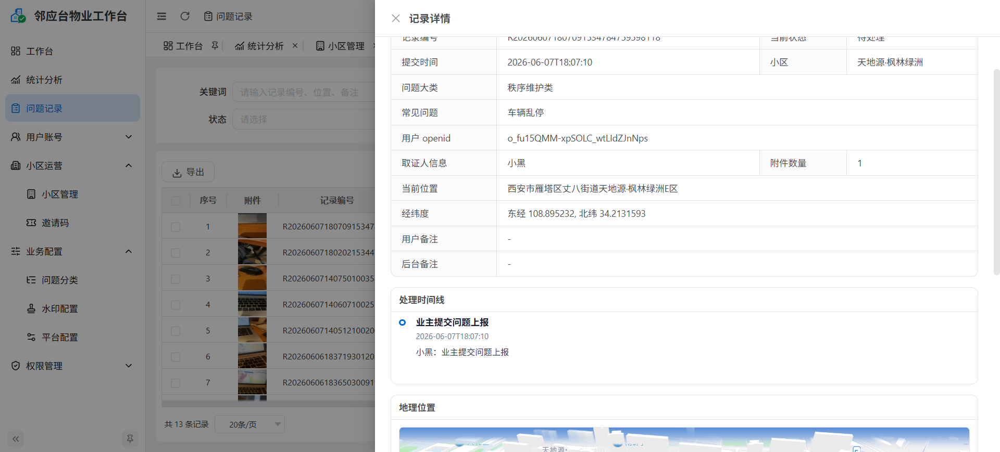

# 邻应台 / Libuke Evidence

邻应台是一个面向住宅小区的业主问题上报与物业处理平台。系统帮助业主通过微信小程序提交公共区域问题，后台人员按小区权限查看、处理、统计和导出记录。

## 项目结构

```text
libuke-evidence
├── libuke-evidence-api      # Spring Boot 后端服务
├── libuke-evidence-web      # Vben Admin 管理后台
├── libuke-evidence-miniapp  # 微信小程序
├── docs/screenshots         # 项目页面截图
```

## 主要能力

- 微信小程序登录与小区邀请码绑定
- 问题上报、图片上传、地理位置采集
- 小区边界校验，防止跨小区提交
- 后台工作台地图、实时问题点位、快捷处理
- 问题记录管理、状态流转、批量操作
- Excel 导出
- 统计分析
- 平台用户、角色、菜单权限
- 小区、邀请码、问题分类、地图、水印、存储配置
- 后台账号按绑定小区控制数据范围

## 页面展示

> 截图使用演示数据展示产品形态。正式开源前如需提交真实截图，请先对用户标识、openid、精确地址、记录编号等信息做脱敏处理。

### 后台登录



后台登录页面向物业或平台运营人员，提供账号密码登录入口，并保留主题、语言、全屏等 Vben Admin 基础交互能力。

### 地图工作台



工作台以小区为核心视角展示问题点位、今日上报、超时未处理记录和分类筛选。后台人员可以按小区切换地图范围，快速定位待处理问题。



地图点位支持弹窗预览，展示问题分类、上报时间和现场图片，便于在不离开工作台的情况下完成初步判断。

### 统计分析



统计分析页用于按时间、小区、大类和状态查看上报总数、待处理、处理中、已处理、超时未处理和平均处理时长，并通过趋势图观察问题变化。

### 小区边界配置



小区管理支持在地图上锁定视角、绘制边界和配置楼栋颜色。边界数据用于小程序端选点校验，避免业主跨小区提交问题。

### 平台配置



平台配置集中维护系统名称、后台标题、小程序名称、运营主体、存储、地图、上传策略和导出配置，便于不同部署环境按实际运营信息调整。

### 记录详情



记录详情页展示问题分类、上报人、位置、经纬度、附件数量、处理时间线和地图定位。后台处理人员可以结合现场图片和位置完成问题核查。

## 技术栈

后端：

- Java 21
- Spring Boot
- MyBatis Plus
- MySQL
- Maven
- Apache POI

Web 后台：

- Vue 3
- TypeScript
- Vben Admin
- Ant Design Vue
- ECharts

小程序：

- 微信小程序
- TypeScript

## 本地启动

启动前请先准备 MySQL 数据库，并执行初始化脚本：

```bash
mysql -u root -p < libuke-evidence-api/src/main/resources/db/init.sql
```

初始化脚本内置一个后台超级管理员账号：

```text
账号：admin
密码：admin123456
```

首次部署后建议立即登录后台修改默认密码。

### 后端

```bash
cd libuke-evidence-api
mvn spring-boot:run
```

后端默认读取环境变量：

```bash
SPRING_DATASOURCE_URL=jdbc:mysql://127.0.0.1:3306/libuke_evidence?useUnicode=true&characterEncoding=utf8&serverTimezone=Asia/Shanghai&useSSL=false&allowPublicKeyRetrieval=true
SPRING_DATASOURCE_USERNAME=root
SPRING_DATASOURCE_PASSWORD=your-password
AMAP_MAP_KEY=your-amap-key
AMAP_JS_API_KEY=your-amap-js-key
AMAP_JS_API_SECURITY_KEY=your-amap-security-key
WECHAT_MINIAPP_APP_ID=your-miniapp-app-id
WECHAT_MINIAPP_APP_SECRET=your-miniapp-app-secret
```

### Web 后台

```bash
cd libuke-evidence-web
pnpm install
pnpm -F @vben/web-antd run dev
```

后台开发地址默认：

```text
http://localhost:5666
```

### 小程序

使用微信开发者工具打开：

```text
libuke-evidence-miniapp
```

本地联调时按实际后端地址修改：

```text
libuke-evidence-miniapp/app.ts
```
